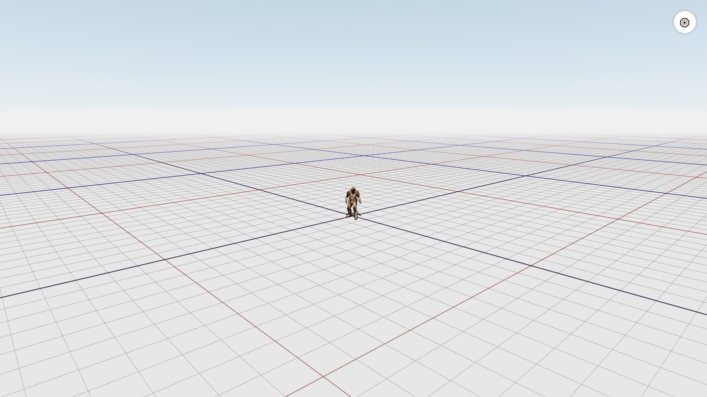

# 🌍 WORLD

**Extensible 3D World** built with [React Three Fiber](https://docs.pmnd.rs/react-three-fiber), [Tweakpane](https://cocopon.github.io/tweakpane/) and [Three.js](https://threejs.org/).  
This project is a clean scene with real-time interactive parameter adjustment capabilities.

> 🔗 **Updates are published here:**  
> https://denworld.vercel.app/

---

## 📸 Screenshots

### Main Scene  



---

## ⚙️ Installation and Setup

### 1. Clone the repository

```powershell
git clone https://github.com/shipilovden/world.git
cd world
```

### 2. Install dependencies

```powershell
npm install
```
or if you're using Yarn:
```powershell
yarn install
```

### 3. Run the project

```powershell
npm run dev
```

After starting, open in your browser:  
[http://localhost:5173](http://localhost:5173)

---

## 🔧 Technologies Used

- **React Three Fiber** — 3D scene rendering
- **Three.js** — base WebGL rendering
- **Tweakpane** — UI for interactive controls
- **Cannon-es** — physics engine
- **Vite** — modern project bundling


---
<<<<<<< HEAD

Проект основан на:

- 📦 [threejs-character-controls-example](https://github.com/tamani-coding/

---
=======
>>>>>>> 5bb8b10 (chore: update README, fix sunlight and voxel behavior)
