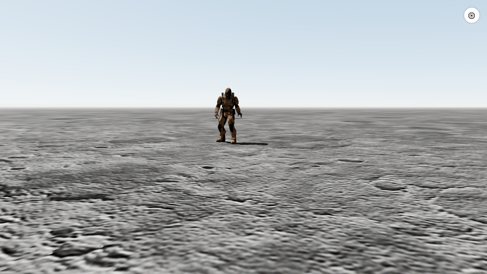
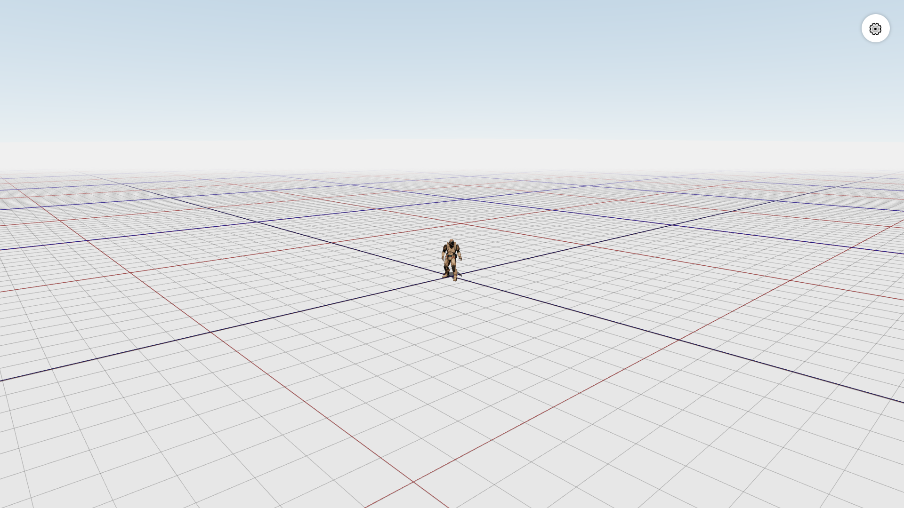

# 🌍 WORLD

**Расширяемый 3D-мир** на базе [React Three Fiber](https://docs.pmnd.rs/react-three-fiber), [Tweakpane](https://cocopon.github.io/tweakpane/) и [Three.js](https://threejs.org/).  
Этот проект — чистая сцена с возможностью интерактивной настройки параметров в реальном времени.

> 🔗 **Обновления публикуются тут:**  
>     https://denworld.vercel.app/

---

## 📸 Скриншоты

### Главная сцена  


### Интерфейс Tweakpane  


---

## ⚙️ Установка и запуск

### 1. Клонирование репозитория

```powershell
git clone https://github.com/shipilovden/world.git
cd world
```

### 2. Установка зависимостей

```powershell
npm install
```
или, если используешь Yarn:
```powershell
yarn install
```

### 3. Запуск проекта

```powershell
npm run dev
```

После запуска открой в браузере:  
[http://localhost:5173](http://localhost:5173)


## 🔧 Используемые технологии

- **React Three Fiber** — рендеринг 3D-сцены
- **Three.js** — базовый WebGL-рендеринг
- **Tweakpane** — UI для интерактивных настроек
- **Cannon-es** — физика
- **Vite** — современная сборка проекта

---

## 🧠 Возможности

- Реалистичная 3D-сцена
- Панель настроек с параметрами:

---

## 🙏 Благодарности

Проект основан на:

- 📦 [threejs-character-controls-example](https://github.com/tamani-coding/threejs-character-controls-example)  
  Автор: [@tamani-coding](https://github.com/tamani-coding)

---